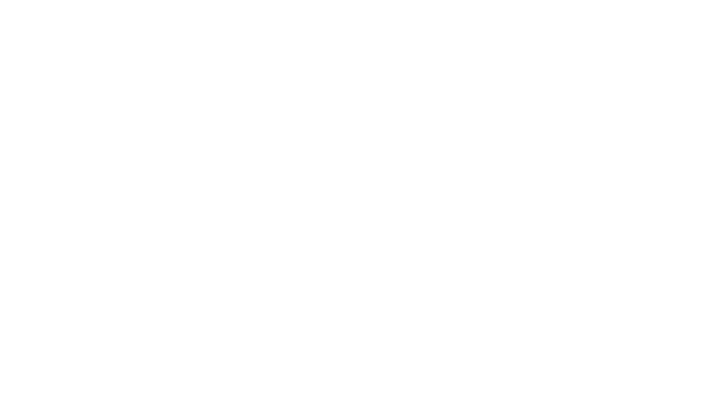

<div align="center">



<br/>
<br/>

# side creative studio

<p>
  
  
  
</p>

<p><strong>where creativity knows no bounds.</strong></p>

<br/>

---

</div>

<br/>

> a dynamic space where ideas come to life and imagination takes center stage. we are passionate about crafting compelling visual stories that resonate with audiences, and we believe in the power of design to make a lasting impact.

<br/>

## the stack

| layer | tech |
|-------|------|
| **framework** | react 18 |
| **bundler** | vite 6 |
| **routing** | react router dom |
| **styling** | plain css, css custom properties |
| **font** | space grotesk |
| **cursor** | custom animated cursor with background detection |

<br/>

## the pages

```
/           landing — hero, video, intro with flip cards
/about      the people behind the studio
/portfolio  project grid with expandable detail
/services   section navigation with typewriter effect
/contact    dynamic greeting, email, contact form
```

<br/>

## getting started

```bash
# clone
git clone https://github.com/AnastasiaKaldi/SideStudio.git
cd SideStudio

# install
npm install

# dev
npm run dev
```

<br/>

## design system

```css
--color-red:    #d50f17
--color-black:  #111111
--color-white:  #ffffff

--font-family:  'Space Grotesk'
```

all text is lowercase. titles are centered. paragraphs are justified. `|` replaces quotes.

<br/>

<div align="center">

---

<sub>crafted by the double n's</sub>

</div>
